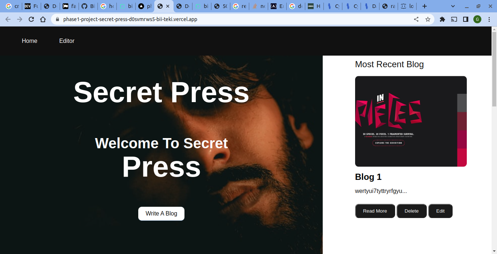
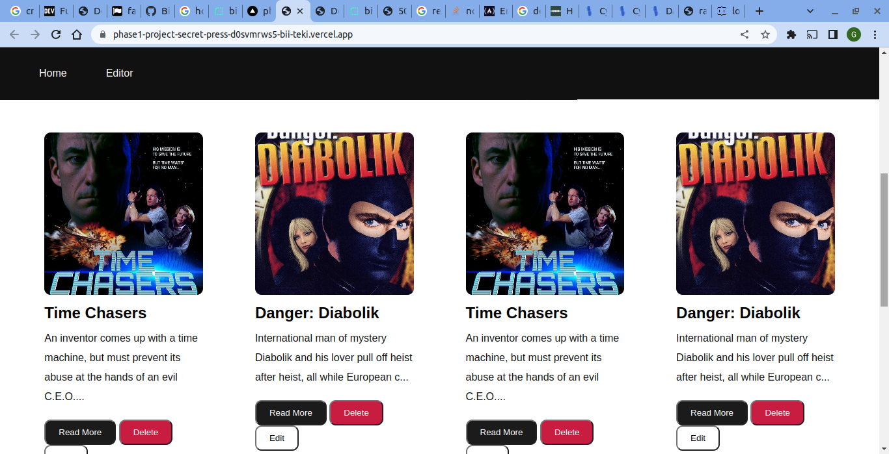
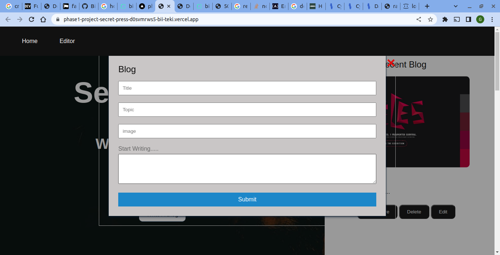
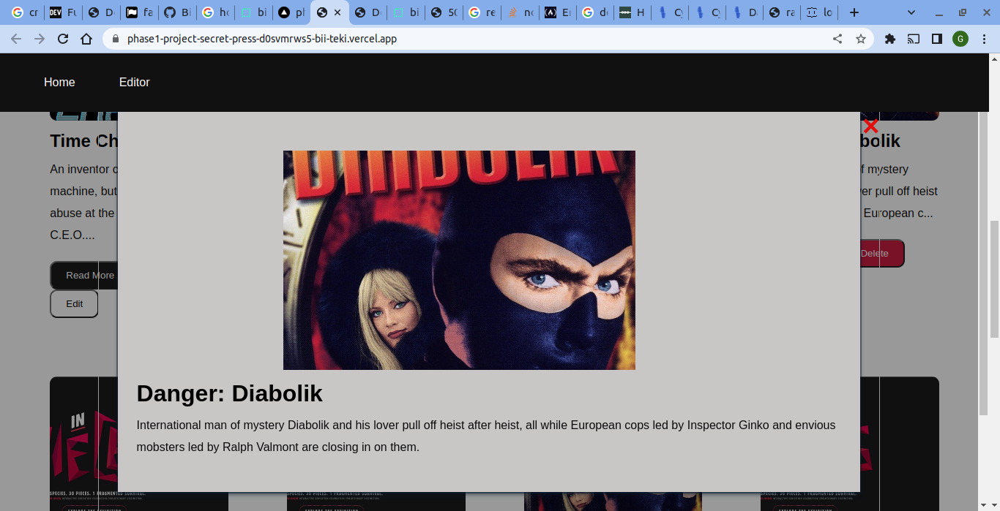

# Secret Press

#### Created By Geoffrey Bii on 06-07-2023

## Design Link

[Github](https://github.com/Bii-teki/phase1-project-secret-press)

## Description

Secret Press is a a website that provides a way to create, update, delete and retrieve blogs. 

## Setup Requirements

- Git
- Web-browser or your choice
- Github
- Visual Studio or coding of your own

## Development server

install `json server` and Run `json-server --watch db.json` for a dev server. install `live serve` and click on go live Navigate to `http://127.0.0.1:5501/`. The app will automatically reload if you change any of the source files.

## Technologies Used

The following have been used on this project:

- HTML
- CSS
- javascript

#### Live link to view the project <a href="https://phase1-project-secret-press-d0svmrws5-bii-teki.vercel.app/">View Jobs Portal</a>

## Screenshots Of the the website

- Homepage

  

- Blogs

  

- Create blog Form Page

  

- view blog

  

## Challanges

one of the key challange faced is to Deploy this project on render

## Support and contact details 🙂

To make a contribution to the code used or any suggestions you can click on the contact link and email me your suggestions.

- Email: gefbii@gmail.com

## License
MIT License

Copyright (c) 2023 Geoffrey Bii

Permission is hereby granted, free of charge, to any person obtaining a copy
of this software and associated documentation files (the "Software"), to deal
in the Software without restriction, including without limitation the rights
to use, copy, modify, merge, publish, distribute, sublicense, and/or sell
copies of the Software, and to permit persons to whom the Software is
furnished to do so, subject to the following conditions:

The above copyright notice and this permission notice shall be included in all
copies or substantial portions of the Software.

THE SOFTWARE IS PROVIDED "AS IS", WITHOUT WARRANTY OF ANY KIND, EXPRESS OR
IMPLIED, INCLUDING BUT NOT LIMITED TO THE WARRANTIES OF MERCHANTABILITY,
FITNESS FOR A PARTICULAR PURPOSE AND NONINFRINGEMENT. IN NO EVENT SHALL THE
AUTHORS OR COPYRIGHT HOLDERS BE LIABLE FOR ANY CLAIM, DAMAGES OR OTHER
LIABILITY, WHETHER IN AN ACTION OF CONTRACT, TORT OR OTHERWISE, ARISING FROM,
OUT OF OR IN CONNECTION WITH THE SOFTWARE OR THE USE OR OTHER DEALINGS IN THE
SOFTWARE.
